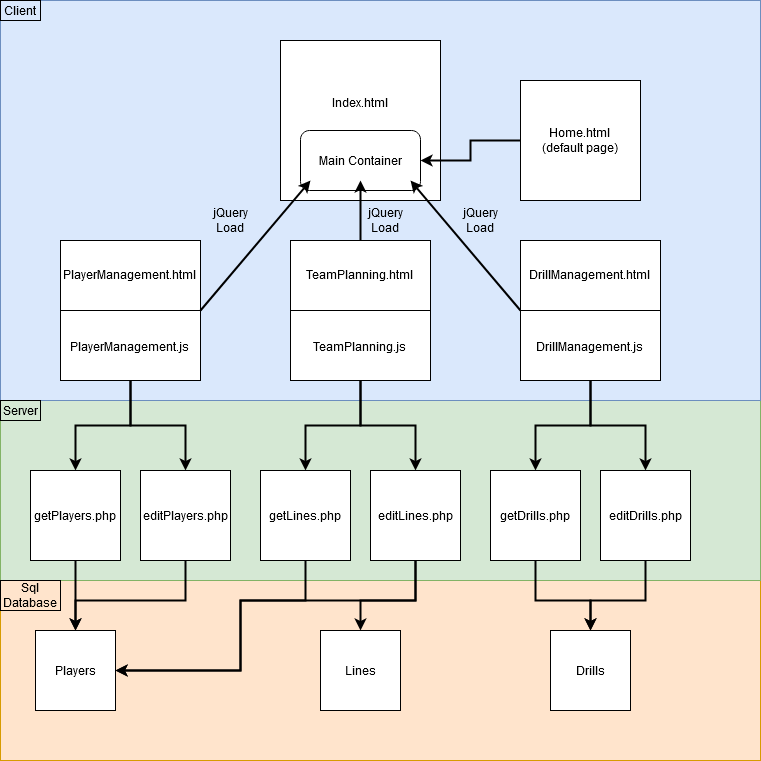

## Introduction

We are creating a sports / team management system that is used to keep track of roster, points, optimal team setups (lines), practice drills and other information related to running a team. It will allow a coach to create and store exercises along with player specific information to ensure the team can be run efficiently and improve itself. To begin it will focus solely on Hockey which is the most popular sport in Canada and fifth most popular in the United States.
 
## Problem solving and algorithms

1. Will allow the coach / manager to store and edit exercises they created including any whiteboard (Javascript Canvas) drawings they may have created to go with the exercises. This will require a database that can store the exercises along with the images and keywords so they can sort through and find the exercises for the skills they are trying to work on.
2. Additionally through the player management system they must be able to load individual player information as well as see who has been most productive to the team with different criteria.
3. The coach finally will be given a team planning form that will allow him to specify the current needs, whether it be they are down in the game and need to know who to put on the field to ensure they score the needed goal, or if they are currently in the lead and need to maintain that by making sure they have a well balanced team out in the playing area. (Ie going for a quick boost of strength or going for long term success) This will be calculated algorithmically on the server and have the ideal group for the situation displayed to the coach.

## System Design

**1. System:** It will be a multi tier web application using multiple tools, as listed in part 2, which allow for quick access to a database where the server retrieves player and drill info and returns it in a readable format to the user in the web browser. The team planning will involve loading player information and user input parameters into a php file which calculates the lineup of players that best meet the requirements and returns it in a readable table to the user. The website will be deployed in docker to ensure the server has all libraries available and compatible with the site requirements.

**2. Tools:** Xampp, Apache, mySQL, JQuery, AJAX, Doctrine for PHP, Composer, and Docker.

**3. Views:**

**4. Architecture:**
   

## Milestones & schedule

List of tasks/milestones/check points of your project with time schedule. For group project, it needs to provide the roles and tasks of each member.

| Task ID | Description   |  Due date | Lead   |  
| :----:  | :------------ | :-----:   | :------: |  
|  1      | Project Research & Team up | Day 5 of week 9 | Ben | 
|  2      | Project Proposal | Day 1 of week 10 | Ben |
|  3      | UI & Database Design Completed  | Day 5 of week 10 | Ben  |
|  4      | UI & Database Connections Completed | Day 5 of week 11 | Ben  |
|  4      | Algorithms & Testing Completed | Day 4 of week 12 | Matt  |
|  6      | Project Demonstration | Day 5 of week 12 | Matt  |
|  7      | Docker Containerization Complete | Day 4 of week 13 | Matt  |
|  8      | Project Submission | Day 5 of week 13 |Matt   |

## References

1. [Doctrine](https://www.doctrine-project.org/)
2. [Composer](https://getcomposer.org/)
3. [Docker](https://www.docker.com/)
4. [Top Ten Sports Canada](https://sportytell.com/sports/top-10-most-popular-sports-in-canada/)
5. [Importance of Hockey Drill Planning](https://www.hockeyshare.com/blog/comments-thoughts/hockey-rink-diagrams-practice-plan-templates/)